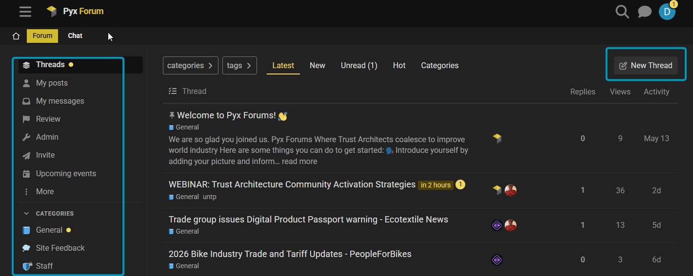
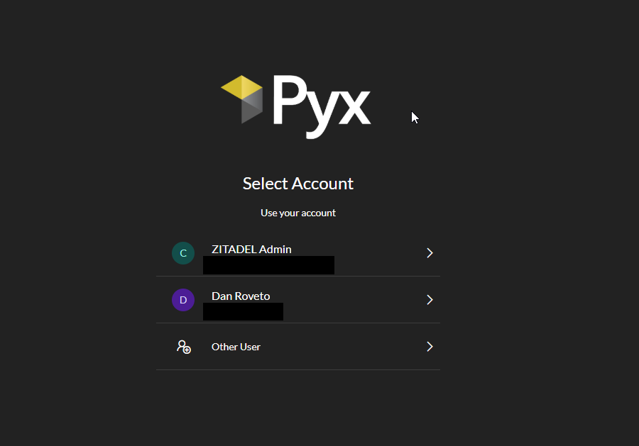
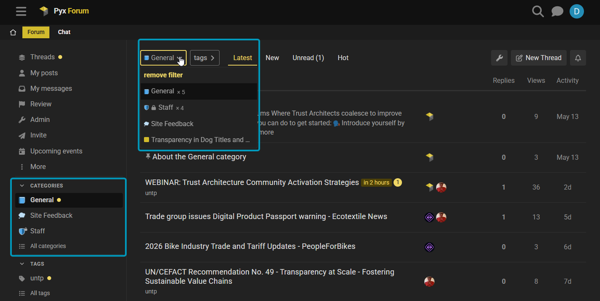
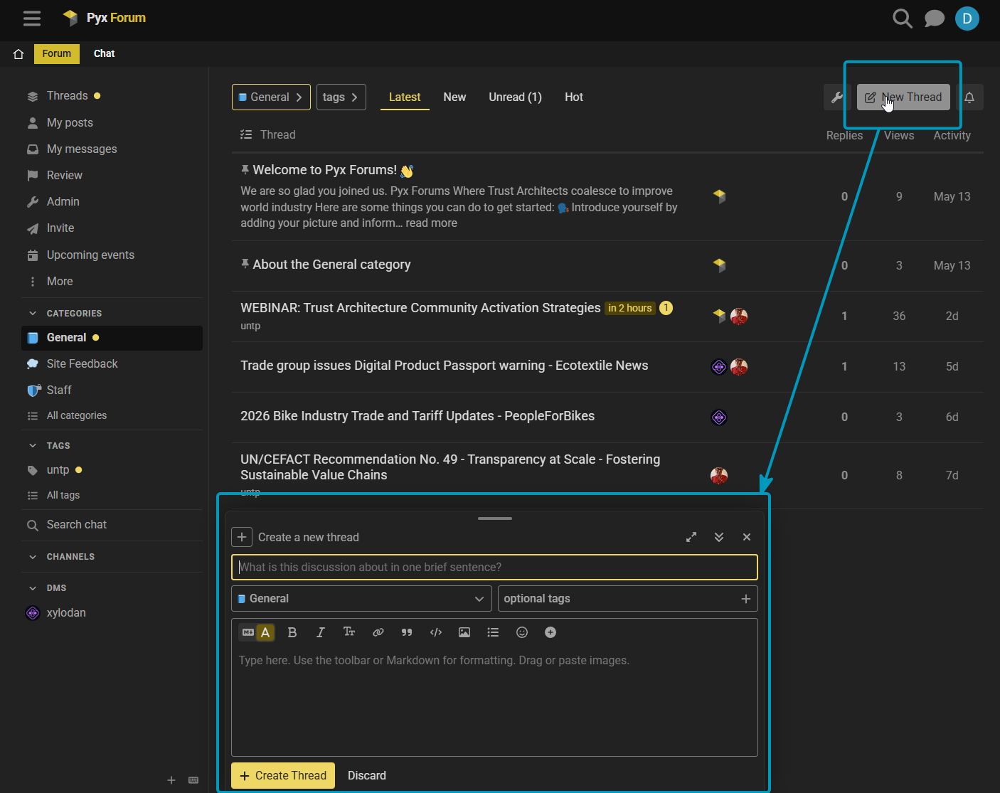
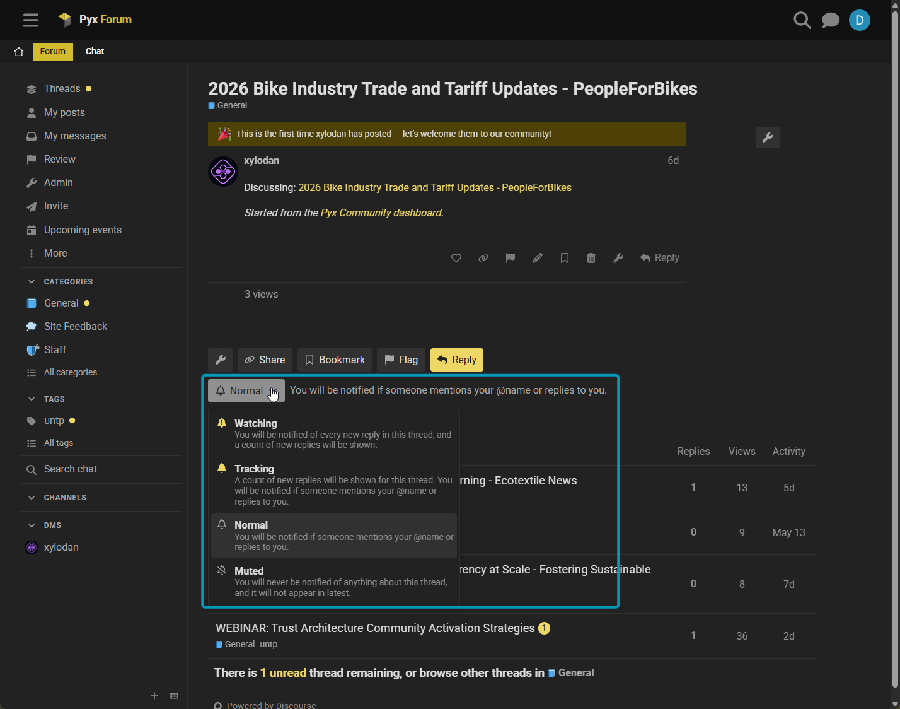

# Pyx Forum Powered by Discourse

The **Pyx Forum** is the community's home for **durable, long-form discussion** —
the place where ideas get room to breathe, decisions get written down, and the
conversation is still there months later when someone needs it. It's powered by
[Discourse](https://www.discourse.org/), the open-source forum platform, and it's
the **system of record for community threads**: if it matters and it should last,
it belongs here.

The Forum is the slow, structured counterpart to [Chat](https://chat.pyx.io). Chat
is for the fast-moving, in-the-moment back-and-forth; the Forum is for the
considered question, the proposal, the write-up, the thing worth finding again.

:::info Where to find it
The Forum lives at **[forum.community.pyx.io](https://forum.community.pyx.io)**.
Sign in with your **Pyx account** — the same single sign-on you use for the
[Dashboard](https://community.pyx.io) and [Chat](https://chat.pyx.io). Anyone can
read the Forum without signing in; sign in when you want to post, reply, or follow
along.
:::

> 💡 **One quick bit of vocabulary:** on the Pyx Forum, a discussion is called a
> **thread** (not a "topic"). You'll see **New Thread**, **Suggested Threads**,
> and so on. *Categories* keep their name. (We use "thread" so it doesn't clash
> with **Topics** on the Dashboard, which mean something different there.)

## 🆚 Forum or Chat — which do I use?

Both are part of the same community and share your one Pyx login. The difference is
**pace and permanence**:

| Use the **Forum** when… | Use **Chat** when… |
| --- | --- |
| You're asking a question others will search for later | You need a quick answer right now |
| You're proposing, announcing, or writing something up | You're brainstorming in real time |
| The discussion should be easy to find weeks from now | It's in-the-moment and ephemeral |
| You want a structured, on-the-record thread | You want a fast, casual back-and-forth |

> Rule of thumb: **if you'd be sad to lose it, put it in the Forum.** New to Chat?
> See the [Pyx Chat guide](./pyxchat-zulip.md).

## ✅ Quick Start

| Action | What to know |
| --- | --- |
| **Sign in** | [forum.community.pyx.io](https://forum.community.pyx.io) with your **Pyx account** (Pyx Community SSO) |
| **Browse** | Open **Categories** to see discussion areas; open a category to see its **threads** |
| **Read** | Click any **thread** to read it — no sign-in needed to read |
| **Start a thread** | **+ New Thread**, pick a category, write a title and your post |
| **Reply** | **Reply** at the bottom of a thread, or reply to a specific post |
| **Follow a thread or category** | Set its notification level (🔔 **Watching / Tracking / Normal / Muted**) |
| **Direct messages** | Message another member 1:1; your forum DMs also appear in your [Dashboard](./pyx-dashboard.md) inbox |
| **Mobile** | Works in any mobile browser; optionally add it to your home screen or use the Discourse app |

---

## 🔑 Step 1: Sign in with your Pyx account

The Pyx Forum uses **Pyx Community single sign-on (SSO)** — the same Pyx account
you use for the [Pyx Community Dashboard](https://community.pyx.io) and
[Chat](https://chat.pyx.io). One account, one login, everywhere. There's no
separate forum username or password to create.

1. Visit [**forum.community.pyx.io**](https://forum.community.pyx.io).
2. Click **Log In** (top-right). The Forum takes you **straight to the Pyx sign-in
   screen** — there's no separate forum login or extra button to choose.
3. Sign in with your **Pyx account** — pick your account (or enter your email and
   password, or continue with Google/GitHub if that's how you set up your Pyx
   account).
4. You'll be returned to the Pyx Forum, signed in. 🎉

<!-- SCREENSHOT (pending RECAPTURE): the Pyx sign-in (Zitadel) screen you land on right after clicking Log In. The captured 260616forum02.png shows real member emails (the account-picker view), so it's held back — recapture the logged-out Pyx sign-in form without personal emails visible. -->
<!--  -->

:::tip Already have a Pyx Forum account?
Sign in **using the same email address** your forum account already uses — your
existing threads, posts, and history come with you automatically; your old and new
accounts are merged into one. (A *different* email creates a separate, empty
account — see the note below.) ✅
:::

:::info New to Pyx?
No Pyx account yet? Create one via the
[Pyx Community Dashboard](https://community.pyx.io), then sign in here with your
**Pyx account**. Your Pyx Forum account is created automatically the first time you
sign in — there's no separate forum sign-up.
:::

:::info Use the same email
The Forum recognizes you by your **email address**. If you sign in with a Pyx
account whose email differs from your original forum account, you'll land in a new,
empty account. If that happens, email **site@pyx.io** and we'll reconnect you to
your history.
:::

---

## 🧭 Step 2: How the Forum is organized

The Forum has two layers: **categories** and **threads**.

### 🔹 Categories

**Categories** are the broad areas the Forum is divided into — think of them as the
rooms of the building. Open **Categories** in the top navigation to see them all,
then click into one to read the threads inside it. A couple of categories you'll
always find:

- **General** — anything that doesn't fit a more specific area; a fine place to
  introduce yourself.
- **Site Feedback** — questions and ideas about the Forum itself and how we can
  improve it.

You'll also see **Initiative categories** — one per Dashboard Initiative (more on
that in [How the Forum connects to the Dashboard](#-how-the-forum-connects-to-the-dashboard)
below). The exact set of categories grows as the community does, so browse the live
**Categories** page for the current list.

### 🔹 Threads

A **thread** is a single discussion inside a category — a question, an
announcement, a proposal — with all of its replies kept together in one place. Each
thread lives in exactly one category, which keeps conversations easy to follow and
easy to search later. (Heads-up: this is what some other forums call a "topic" —
on the Pyx Forum it's a **thread**.)

---

## ✍️ Step 3: Start a thread, reply, and format

### Start a thread

1. Click **+ New Thread** (top-right).
2. Choose the **category** it belongs in.
3. Write a clear **title** — this is what people see in lists and search.
4. Write your post in the editor, then click **Create Thread**.

### Reply

- Use the **Reply** button at the bottom of a thread to add to the conversation.
- To respond to one specific post, use the **Reply** arrow on that post — your reply
  is linked to it so context is clear.
- **@mention** someone (type `@` and their name) to notify them directly.
- Use **Quote** (select text → **Quote**) to reply to a specific passage.

### Formatting

The editor accepts **Markdown** and has a toolbar if you'd rather click than type:

- `**bold**`, `*italics*`, and `` `inline code` ``
- Headings, bulleted and numbered lists, and block quotes (`>`)
- Links, and **drag-and-drop or paste images and files** straight into a post
- Fenced code blocks (triple backticks) for snippets
- Emoji 🎉 (type `:` to search) and a live **preview** beside the editor

A small **toolbar** above the editor covers all of the above if you'd rather not
remember the syntax.

---

## 🔗 How the Forum connects to the Dashboard

The Forum doesn't stand alone — it's wired into your
**[Pyx Dashboard](./pyx-dashboard.md)**.

- **Forum activity shows up in your Dashboard feed.** New threads and discussions
  flow into your home feed on the Dashboard, labelled as coming from the Forum, so
  you see what's happening without having to check both places.
- **Each Dashboard Initiative maps 1:1 to a forum category of the same name.** When
  an Initiative needs a home for discussion, a matching forum category is created
  automatically. Discussions and events you start in an Initiative are posted into
  that category (as you — the Forum is the system of record), and in return, threads
  posted in that category flow back into the Initiative's activity on the Dashboard.
  So an Initiative's Dashboard page and its forum category are **two views of the
  same conversation**.

> 💡 You can start a forum thread straight from a Dashboard feed card with **Start a
> discussion** — see the [Dashboard guide](./pyx-dashboard.md) for the full story on
> Spaces, Initiatives, and the feed.

### 📅 Events

Community **events** live on the Forum too: an event is posted into its Initiative's
forum category, and that's where **RSVPs** are recorded. You'll see upcoming events
in the **Upcoming events** panel on your Dashboard and can RSVP right from there;
the first time, you'll be asked to sign in to the Forum so the RSVP is recorded as
you. Creating events is handled by an Initiative's chair/architect — see the
[Dashboard guide](./pyx-dashboard.md) for how events and RSVPs work end to end.

---

## 💬 Direct messages

You can send a **direct message** to another member from their profile or from the
✉️ messages area — handy for a quick 1:1 that doesn't belong in a public thread.

Your forum DMs also appear in your **[Dashboard](./pyx-dashboard.md) Messages
inbox**, so you can read and reply to them alongside your other Pyx messages without
leaving the Dashboard. (The Dashboard shows *your* messages to *you* under your own
account, and never stores them — see the [Dashboard guide](./pyx-dashboard.md).)

---

## 🔔 Notifications & preferences

The Forum lets you decide exactly how closely you follow things, per category and
per thread. At the bottom of any thread (or category) is a **notification control**
with four levels:

- **🔔 Watching** — notified of every new reply.
- **Tracking** — counts unread replies; notified when you're @mentioned or replied
  to.
- **Normal** *(default)* — notified only when you're @mentioned or replied to.
- **Muted** — keep it out of your lists and notifications entirely.

To tune the rest, click your **avatar → the person icon → Preferences →
Notifications** (and **Emails** for digest/email settings). You can set a regular
**email digest** of popular threads so you stay in the loop without checking in
daily.

---

## 📱 Mobile access

The Forum works well on a phone with **no app required** — just open
[forum.community.pyx.io](https://forum.community.pyx.io) in your mobile browser and
sign in with your Pyx account as usual.

For a more app-like experience you can:

- **Add it to your home screen** — in your mobile browser's menu choose *Add to Home
  Screen*; it opens full-screen like an app (it's a Progressive Web App).
- **Use the Discourse app** — install **Discourse** (the official app, sometimes
  shown as *Discourse Hub*) from the App Store or Google Play, then add the site
  **`https://forum.community.pyx.io`** and sign in with your Pyx account.

Mobile push and email notifications follow the same preferences you set above.

---

## 🆘 Need help?

- Post in **Site Feedback** on the Forum, or
- Ask in the [community chat](https://chat.pyx.io), or
- Email **site@pyx.io** for direct assistance.

We're glad you're here — see you in the threads. 🧵

---

## Need Interactive Support?

:::info Get Live Help
🚀 **Join our community chat** for real-time assistance with UNTP implementation questions!

[**💬 Chat with UNTP Experts**](https://chat.pyx.io/#narrow/stream/25-Community---UNTP-Topics) - Get instant help from our community of developers and trust architects.
:::

---
