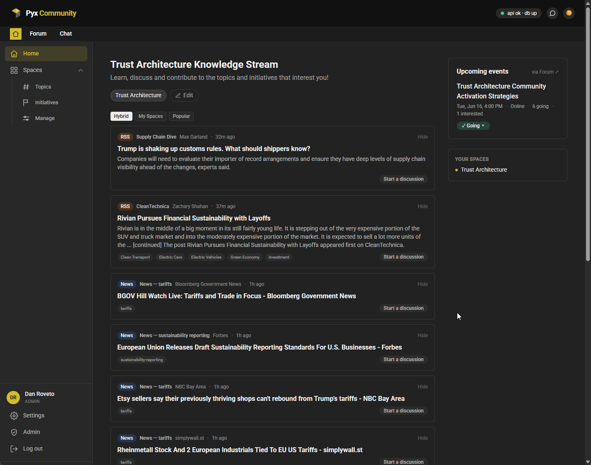
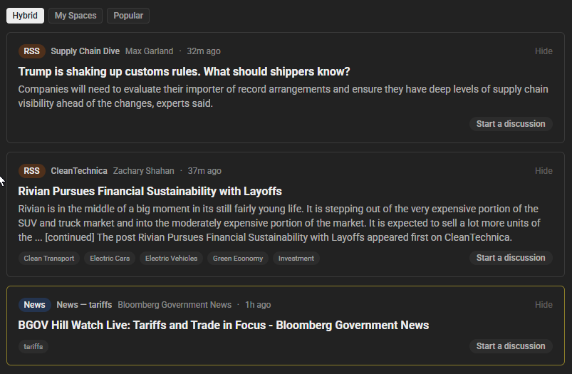
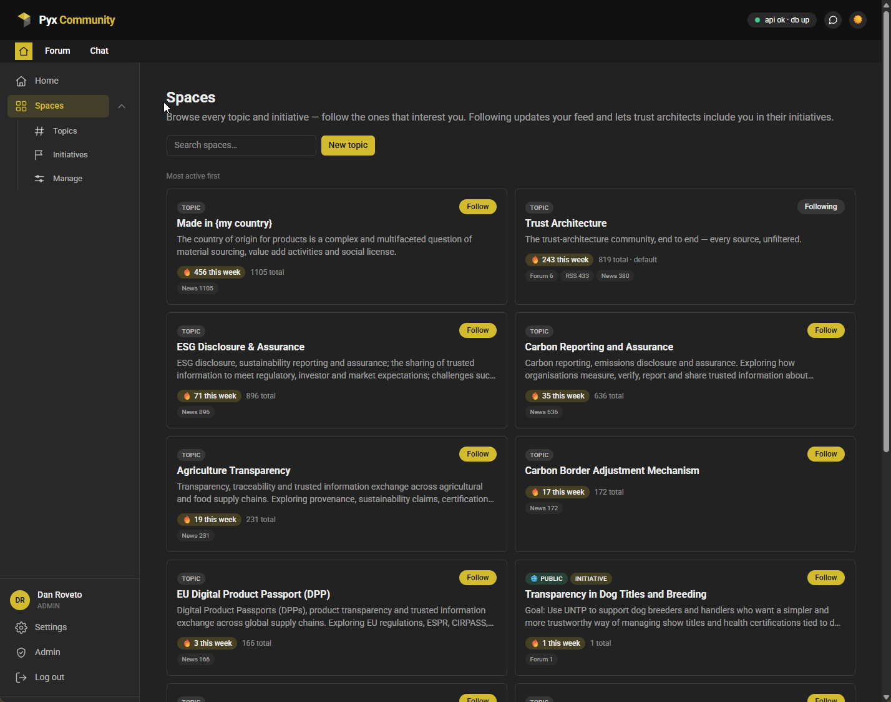
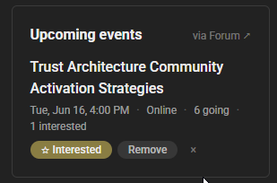
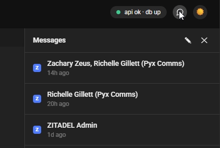
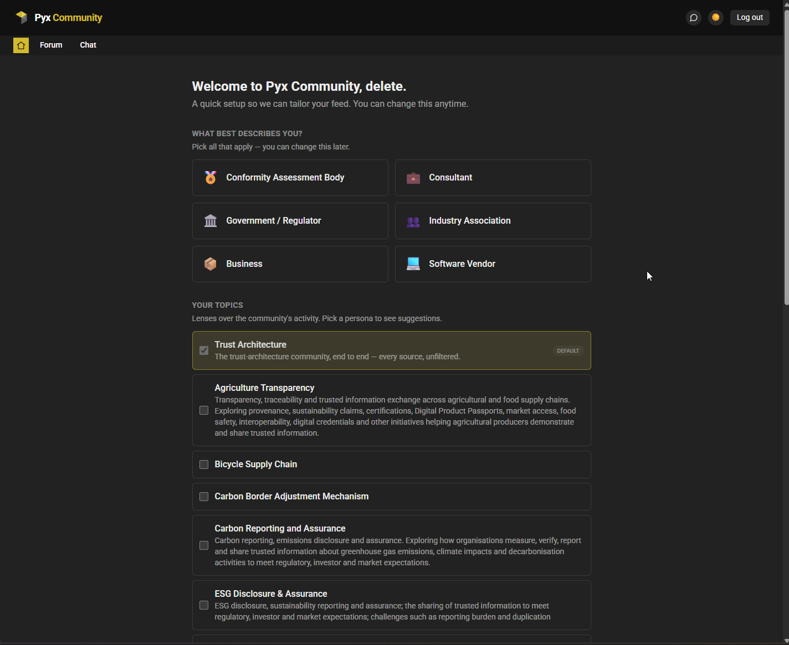

# The Pyx Dashboard

The **Pyx Dashboard** is your front door to the Pyx community. It's the
personalized home you start from: one place that pulls together what's
happening across the blog, the forum, chat, and a curated set of trusted news
sources — and then sends you straight into the right tool when you want to
join in.

The Dashboard doesn't replace the forum or chat. It's the **layer above** them:
a single feed of activity, a way to organize what you follow into **Spaces**,
and quick deep-links into the conversations that matter to you.

:::info Where to find it
The Dashboard lives at **[community.pyx.io](https://community.pyx.io)**. Sign in
with your **Pyx account** — the same login works across the Dashboard, the
[Forum](https://forum.community.pyx.io), and [Chat](https://chat.pyx.io).
:::

## Quick start

| You want to… | Where | What happens |
| --- | --- | --- |
| **Sign in** | "Log in", top-right at [community.pyx.io](https://community.pyx.io) | Sign in with your Pyx account (single sign-on). |
| **Set up your home** | Onboarding (first sign-in) | Pick what describes you and the topics you care about — tailors your feed. |
| **Read what's new** | Home feed | Aggregated activity from the blog, forum, chat, and curated sources. |
| **Focus your feed** | Feed modes + topic toggles | Switch between **Hybrid**, **My Spaces**, and **Popular**; mute topics you don't want right now. |
| **Follow a subject** | **Spaces → Topics** | Follow (or start) a Topic; it then feeds into your home. |
| **Tidy your feed** | "Hide" on any feed card | Hide a source you don't want; manage the list in **Settings**. |
| **Collaborate on something** | **Spaces → Initiatives** | Action-oriented Spaces with events and a dedicated forum category. |
| **Check your DMs** | Messages icon (top bar) | See and reply to your direct messages without leaving the Dashboard. |

---

## 🔑 Signing in

The Dashboard uses **single sign-on with your Pyx account** — the same identity
you use for the Forum and Chat. There's no separate Dashboard username or
password to create.

1. Go to **[community.pyx.io](https://community.pyx.io)**.
2. Click **Log in** (top-right).
3. Sign in with your Pyx account. You'll land back on your Dashboard.

The first time you sign in, you'll go through a short **setup** (see
[Getting set up](#-getting-set-up-personas--topics) below). After that,
the Dashboard remembers you.

> ℹ️ New to Pyx? Your **Pyx account** is the single login across the
> Dashboard, [Forum](https://forum.community.pyx.io), and
> [Chat](https://chat.pyx.io) — create one the first time you sign in.

---

## 📰 Your feed

The heart of the Dashboard is the **feed** — a single, ranked stream of recent
activity drawn from across the community:

- **Blog** posts (from [pulse.pyx.io](https://pulse.pyx.io))
- **Forum** topics and discussions ([forum.community.pyx.io](https://forum.community.pyx.io))
- **Chat** activity ([chat.pyx.io](https://chat.pyx.io))
- **Curated news sources** — a hand-vetted set of feeds relevant to trust
  architecture, supply-chain transparency, digital product passports, and
  related areas, maintained by the Pyx team.

Every card shows **where it came from**: a coloured **source label**
(News, Blog, RSS, Forum, Chat, or Pinned) plus the specific source name —
for example *"W3C – Blog"*. Click a card to open the original item in a new
tab.

### Choosing how your feed is composed

Above the feed are three small mode buttons:

- **Hybrid** *(default)* — your followed topics and initiatives ranked higher,
  with the community's most popular items still mixed in.
- **My Spaces** — only the topics and initiatives you follow.
- **Popular** — the most popular items across the whole community, with no
  follow-based boost.

Just below your followed topics, each appears as a **toggle**. They're all
**on** by default — click one to mute its items from the feed for now, click
again to bring it back. (Want to change which topics you follow? Use **Edit**,
which takes you to your Spaces.)

### Hiding a source you don't want

Not every source is for everyone. On any feed card, click **Hide** to remove
that source from your feed — it disappears immediately and stays hidden
everywhere (home and inside Spaces). You can review and un-hide sources anytime
under **Settings → Hidden sources**.

To keep any single source from flooding your home feed, the Dashboard also
caps how many items each source contributes at once — so the best from each
source still shows, without one busy source crowding everything else out.

---

## 🗂️ Spaces: Topics and Initiatives

**Spaces** are how you organize the community around the subjects you care
about. A Space gathers relevant activity into one place and lets you follow it.
There are two kinds.

### Topics — open, anyone can start one

A **Topic** is a lightweight, non-committal lens on a subject — an industry,
technology, initiative, or challenge you want to keep an eye on. Anyone signed
in can **start a Topic**, and the Dashboard immediately begins tracking news
for it. Others can follow your Topic too, which makes the feed richer for
everyone.

Everyone starts out following the default **Trust Architecture** topic.

**Roles on a Topic** (the people who tend it):

- **Spokesperson** — the person who started it; tends the Topic and can hand
  the role to someone else.
- **Supporter** — helps curate the Topic's sources and content.
- **Follower** — anyone following along; following gives the Topic a boost in
  your feed.

### Initiatives — action-oriented, and gated

An **Initiative** is for getting something done together — a pilot, a working
group, a project. Initiatives have more structure than Topics: a dedicated
forum category, events, and an invite list.

Because they're action-oriented, **starting an Initiative unlocks once you've
engaged with the community** — following or starting any Topic is enough. Until
then, you'll see a friendly prompt rather than a locked door. (You can always
*follow* and take part in Initiatives; the gate is only on *founding* one.)

**Roles on an Initiative:**

- **Chair** — runs the Initiative: manages the roster, sends invites, and can
  hand the chair to someone else.
- **Architect** — helps manage the Initiative's content, sources, and events.
- **Follower** — takes part and gets the Initiative boosted in their feed.

> 💡 Topics and Initiatives work the same way under the hood — an Initiative is
> just a Topic that's grown into something more deliberate. The role names
> differ to match the tone (Spokesperson/Supporter for Topics,
> Chair/Architect for Initiatives), but following, feeds, and sources behave
> the same.

### Following a Space

On any Space (or in the Spaces directory), click **Follow**. Following:

- pulls that Space's activity into your home feed (and into the **My Spaces**
  mode), and
- lets the people running an Initiative include you.

Leaving is always your choice — just **unfollow**. No one can remove you from a
Space; the most a Chair can do is step someone down from Architect back to
Follower.

### Running a Space you started or help tend

If you're a Topic's Spokesperson/Supporter or an Initiative's Chair/Architect,
each Space gets a **settings** panel (the gear) where you can:

- edit the name, description, and tags;
- **add sources** specific to that Space — a *news phrase* to watch (e.g.
  *"battery passport"*), or, under **Advanced**, a blog RSS feed, a forum
  category, or a chat link;
- (Initiatives) set **visibility**, manage **invites**, link **related
  topics**, and **add events**.

> ℹ️ The community's curated news sources already flow into everyone's home
> feed automatically — you don't need to add those. A Space's own sources are
> for what's *specific to that Space*.

---

## 🔗 How Initiatives connect to the Forum

Each **Initiative** is paired one-to-one with a **category on the Forum** of
the same name, created automatically the first time it's needed. This keeps the
Dashboard and the Forum in sync:

- **Discussions and events** you start in the context of an Initiative are
  posted into that Initiative's forum category (as you — the Forum is the
  system of record).
- In return, **topics posted in that forum category flow back** into the
  Initiative's activity feed on the Dashboard.

So an Initiative's Dashboard page and its forum category are two views of the
same conversation — start it in either place, and it shows up in both.

### Events & RSVPs

Initiatives can host **events**. A Chair or Architect adds an event from the
Initiative's page (with a date, optional meeting link, and details); it's
posted to the Initiative's forum category, where RSVPs live.

Upcoming events show in the **Upcoming events** panel on your home Dashboard,
and you can **RSVP** (*Going* / *Interested*) right from there. RSVPs are
recorded on the Forum, so you'll need a forum account the first time.

### Starting a discussion from a feed item

See something in your feed worth talking about? Use **Start a discussion** on
the card to open a forum thread about it — posted as you, with a link back to
the item added automatically. (You'll need a forum account; if a thread already
exists, the card links you straight to it with **Join the discussion**.)

---

## 💬 Messages

The Dashboard includes a **Messages** inbox so you can read and reply to your
**direct messages** from across Pyx without leaving the page. Open it from the
message icon in the top bar (it also shows an unread badge).

- **Forum (Discourse) DMs** — the first time, click **Connect forum account**
  and approve access on the Forum using your own account. After that, your
  forum DMs appear in the Dashboard inbox; you can read, reply, and start over
  to the Forum anytime. Disconnect whenever you like from
  **Settings → Connected accounts**.
- **Chat (Zulip) DMs** — your chat DMs join the same inbox automatically using
  your Pyx login (nothing to connect).

A few important guarantees:

- The Dashboard is a **live viewport**, not a message store — **Pyx never
  stores your messages**. Everything is fetched live and every conversation
  deep-links back to the source tool.
- It's all under **your own account** — connecting your forum account just lets
  the Dashboard show *your* messages to *you*; you can revoke access at any time
  (from the Dashboard, or in your Forum preferences under Security → Apps).

The Dashboard does **not** add a new messaging system — the forum and chat
remain the system of record for your conversations. It just brings them into
one inbox.

---

## 🙋 Getting set up: personas & topics

The first time you sign in, a short **setup** tailors your Dashboard:

1. **What best describes you?** Pick all that apply — for example *Consultant*,
   *Business*, *Government / Regulator*, *Industry Association*, *Conformity
   Assessment Body*, or *Software Vendor*. (You can be more than one.)
2. **Your topics.** We pre-select a few topics suggested for the personas you
   chose; add or remove any. The default **Trust Architecture** topic is always
   included.
3. **Organization** *(optional)* — where you work.
4. **Communications** — opt in (only if you want) to the Pyx newsletter, and to
   being set up on the Forum and Chat. Nothing is sent unless you tick it.

Your **persona** is about **personalization, not permissions** — it tunes how
your feed is ranked, nothing more. It never changes what you're allowed to do.
You can change your persona (and everything else) anytime under **Settings**.

### Settings

**Settings** shows your account (name, email, organization), your persona
editor, your **hidden sources**, and your **connected accounts**. More
preferences are on the way.

---

## 🔮 Coming soon

- **Live credential stream (UNTP).** A stream of verifiable credentials from
  trust architects' Identity Resolvers, surfaced as they're issued. This is on
  the roadmap and **not yet live** — it's being wired up against a real
  Identity Resolver.

*(We'll add new capabilities to this page as they ship.)*

---

## 🧭 How the Dashboard relates to Chat, Forum, and the Blog

The Dashboard is the **front door** — it surfaces and links, rather than
replacing the tools where the actual work happens:

| Tool | What it's for | The Dashboard's role |
| --- | --- | --- |
| **[Forum](https://forum.community.pyx.io)** (Discourse) | Long-form discussion, Q&A, events | Surfaces forum activity in your feed; Initiatives map to forum categories; you can start discussions, RSVP to events, and read forum DMs from the Dashboard. |
| **[Chat](https://chat.pyx.io)** (Zulip) | Real-time conversation | Surfaces chat activity in your feed; chat DMs can join the Dashboard inbox. |
| **[Blog](https://pulse.pyx.io)** (Pulse) | News and articles from Pyx | Blog posts flow into your feed. |

Think of it this way: **the Dashboard is where you find out what's happening
and decide where to jump in; the Forum, Chat, and Blog are where you do the
thing.** One sign-in ties them all together.

### See also

- [Pyx Chat (Zulip)](./pyxchat-zulip.md) — getting started with community chat
- [Pyx Forum](https://forum.community.pyx.io) — long-form discussion and Q&A
- [Pyx Pulse](https://pulse.pyx.io) — the Pyx community blog

---

## Need Interactive Support?

:::info Get Live Help
🚀 **Join our community chat** for real-time assistance with UNTP implementation questions!

[**💬 Chat with UNTP Experts**](https://chat.pyx.io/#narrow/stream/25-Community---UNTP-Topics) - Get instant help from our community of developers and trust architects.
:::

---
