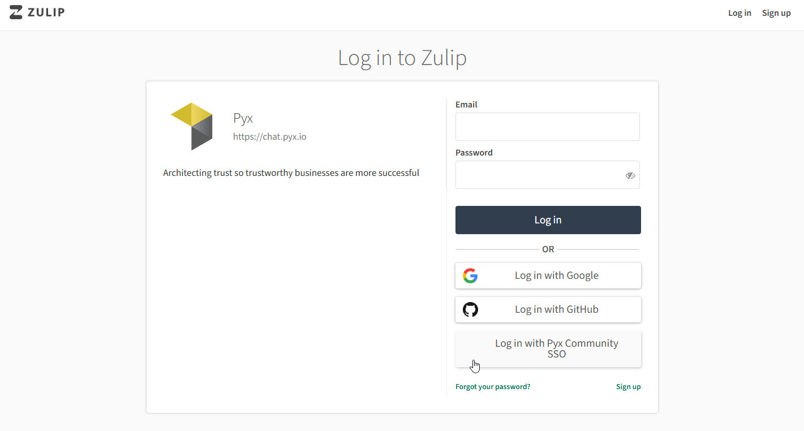

# Pyx Chat Powered by Zulip

:::info
**Zulip is our real-time messaging platform built for focused, async-friendly conversations. Learn how to get the most out of our community chat.**

Need help? Join our [💬 UNTP community chat](https://chat.pyx.io/#narrow/stream/25-Community---UNTP-Topics) for live support.
:::

Zulip is our real-time messaging platform built for focused, async-friendly conversations. If you've used Slack or Microsoft Teams, you'll find Zulip familiar—but its **threaded model** offers powerful advantages for keeping discussions organized, especially in our distributed and global community.

## 🛠 What You'll Use Zulip For

In the Pyx space, Zulip is where we:

- 💬 Coordinate projects and cross-functional work
- 🧠 Share ideas, questions, and documentation updates
- 🔔 Stay in the loop on announcements and platform changes
- 🤝 Connect with contributors, builders, and advocates

## ✅ Quick Start

| Action | What to Remember |
| --- | --- |
| Sign in | [Pyx chat](https://chat.pyx.io) with your **Pyx account** (Pyx Community SSO) |
| Channels | Broad conversation areas (like Slack channels) |
| Topics | Focused threads inside each channel |
| Replying | Always reply in-topic to keep conversations clear |
| New posts | Create a new topic in the correct channel |
| Notifications | Customize your preferences under Settings |
| Mobile access | Use the Zulip app with `https://chat.pyx.io` |

## 📖 Detailed Instructions

## 🔑 Step 1: Sign in with your Pyx account

Pyx Chat uses **Pyx Community single sign-on (SSO)** — the same Pyx account you
use for the [Pyx Community Dashboard](https://community.pyx.io) and the forum.
One account, one login, everywhere.

1. Visit [**chat.pyx.io**](https://chat.pyx.io)
2. Click **Sign in with Pyx Community SSO**.
3. On the Pyx sign-in screen, enter your **Pyx account** email and password
   (or continue with Google/GitHub if that's how you set up your Pyx account).
4. You'll be returned to Pyx Chat, signed in. 🎉

:::info Which button do I click?
The sign-in screen currently shows a few login options. Please use
**Sign in with Pyx Community SSO** — that's the one tied to your Pyx account and
the one we're standardizing on across Pyx.
:::

:::tip Already have a Pyx Chat account?
Sign in with Pyx Community SSO **using the same email address** your chat account
already uses — your existing chat history, channels, and direct messages come
with you automatically. (A *different* email creates a separate, empty account —
see the note below.) ✅
:::

:::info New to Pyx?
No Pyx account yet? Create one via the
[Pyx Community Dashboard](https://community.pyx.io), then sign in here with
**Pyx Community SSO**. Your Pyx Chat account is created automatically the first
time you sign in — there's no separate chat sign-up.
:::

:::info Use the same email
Pyx Chat recognizes you by your **email address**. If you sign in with a Pyx
account whose email differs from your original chat account, you'll land in a
new, empty chat account. If that happens, email **site@pyx.io** and we'll
reconnect you to your history.
:::

---

## 🧭 Step 2: Understand Zulip's Structure

Zulip organizes communication using two key elements:

### 🔹 Channels

Channels are broad conversation spaces similar to Slack channels or Teams groups. Each channel has its own set of **topics** (threads) underneath it. Examples:

- `#general` — General purpose channel for discussions on UNTP, or just to introduce yourself to the chat.
- `#pyxee` — The home of our resident AI Agent who is an expert on UNTP.  Pyxee responds to all conversations on this channel.
- `#private` — A lock symbol means the channel is private.  If you'd like access to a private channel, send a message to the Zulip user named "Pyx Global" or send an email to site@pyx.io

### 🔹 Topics

Topics are **threads** within a channel. Every message in Zulip must belong to both a **channel** and a **topic**. This keeps discussions focused and easy to follow.

For example:

→ `#pyxee > Pyxee Hangout`

→ `#general > Greetings`

This structure makes it simple to catch up, search for prior discussions, and avoid crossed conversations.

---

## 📥 Step 3: Subscribe to Channels

You're automatically subscribed to a few key channels, but you can explore more:

1. Click **"Channels"** in the left sidebar
2. Browse or search available channels
3. Click **Subscribe** to join channels relevant to your work or interests

You'll receive notifications only from the channels you're subscribed to, keeping noise to a minimum.

---

## ✍️ Step 4: Send Messages

Zulip requires that all messages be posted under a **topic** within a **channel**.

- **Reply** within an existing topic to continue a conversation
- **Start a new topic** under the appropriate channel for new ideas, questions, or announcements
- Use `@username` to mention a person, or `@channel` to notify everyone subscribed

### ✨ Formatting Tips:

- Use `*bold**`, `_italics_`, or `~~~code blocks~~~` for clarity
- Attach files or paste links just like you would in email or chat
- Use emojis to keep things friendly and expressive 😄

---

## 🔧 Step 5: Adjust Your Notifications (Optional)

Zulip allows granular control over when and how you're notified:

1. Click your profile icon → **Settings**
2. Go to the **Notifications** tab
3. Choose preferences for desktop, mobile, email, and sound

---

## 📱 Mobile Access

Zulip is also available on iOS and Android:

- Download the **Zulip app** from the App Store or Google Play
- Use the server URL: **`https://chat.pyx.io`**
- Sign in with your **Pyx account** — the same Pyx Community SSO login you use on the web

Mobile notifications are customizable to keep you in the loop without being overwhelmed.

---

## 🆘 Need Help?

If you're unsure where to post or need assistance:

- Ask in the `#help` channel
- Or email site@pyx.io for direct assistance

We're here to help you get the most out of the Pyx collaboration space.

---

## Need Interactive Support?

:::info Get Live Help
🚀 **Join our community chat** for real-time assistance with UNTP implementation questions!

[**💬 Chat with UNTP Experts**](https://chat.pyx.io/#narrow/stream/25-Community---UNTP-Topics) - Get instant help from our community of developers and trust architects.
:::

---